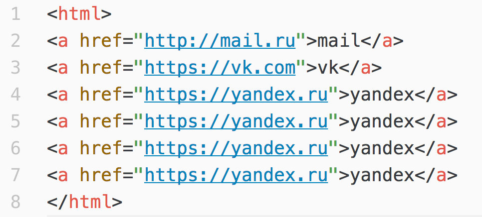
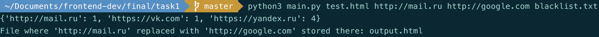
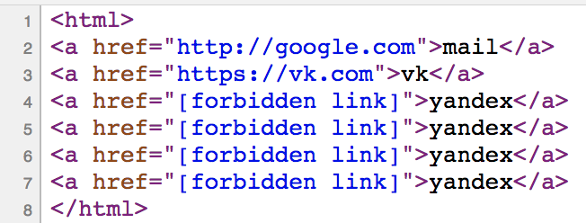

Script
* Prints URLs frequency dict
* Replaces specific URL with another one
* Replaces URLs from black list with `[forbidden url]`

Usage:
```bash
python main.py input_file.html url_to_find url_to_replace_with blacklist_urls_list.txt
```

1. Initial HTML file with urls



2. Run script and see URLs frequency dict has been printed.



3. Output HTML file


